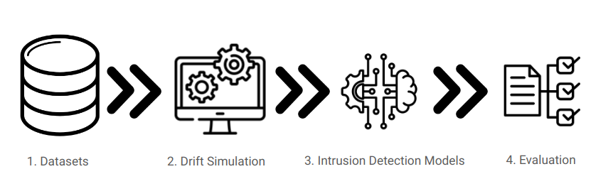

# Mudança de conceito (concept drift)

Este projeto cobre o cenário de mudança de conceito, em que as distribuições dos dados evoluem ao longo do tempo e o desempenho do IDS pode degradar, exigindo avaliação temporal estruturada.



## Etapas do framework

1) Seleção do dataset

Uso do [CIC-IDS2017](https://www.unb.ca/cic/datasets/ids-2017.html), com extração de fluxos via [NFStream](https://www.nfstream.org), selecionando fluxos benignos e fluxos de ataque (classificação binária).

2) Transformação dos dados (mudança de conceito)

Aplicação dos algoritmos de transformação para simular diferentes padrões de drift: abrupto, recorrente e gradual.

3) Treinamento do modelo

Treinamento do modelo baseado em [ADWIN Boosting](https://riverml.xyz/0.23.0/api/drift/ADWIN/).

4) Avaliação do modelo

Avaliação do desempenho ao longo do tempo, de acordo com o protocolo experimental definido.

## Execução (Python + Jupyter em Docker)

rodar da imagem:

```bash
docker run -it --rm -p 8888:8888 -p 7080:7080 -v "${PWD}":/home/jovyan/work quay.io/jupyter/datascience-notebook:2025-03-14
```

